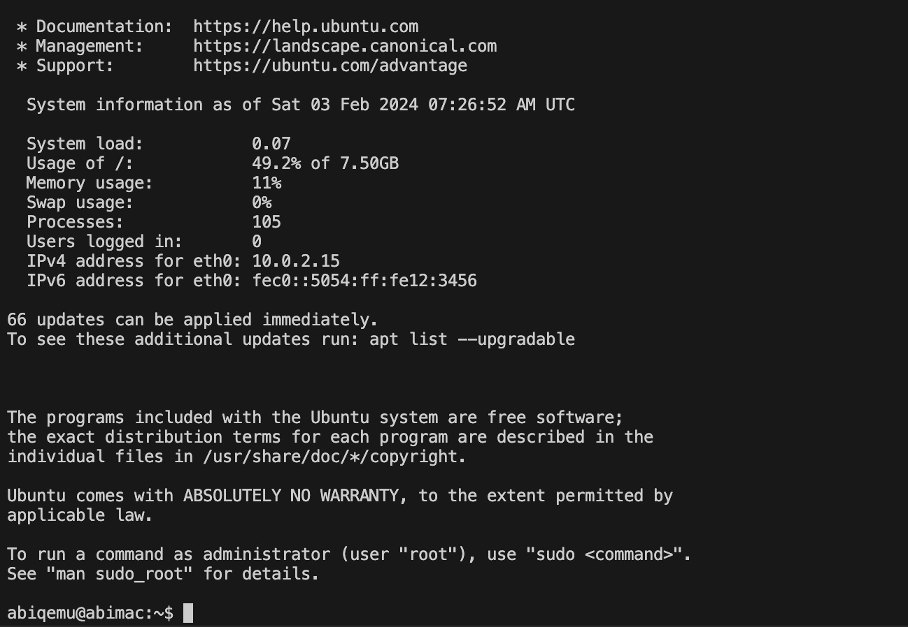
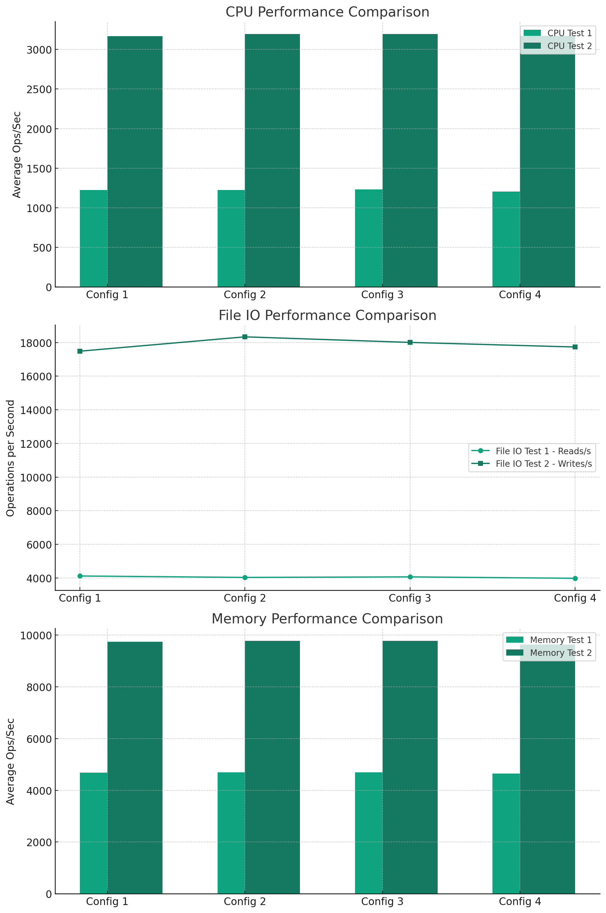

# CSEN 241 HW 1 - System vs OS Virtualization

github repo:https://github.com/AAbiAbi/QEMU.git

## Environment Setup
Apple Mac M2 Chip, Ventura 13.1

Qemu 8.2.1

## System Virtualization (QEMU) Setup

### Creating QCOW2 Disk Image
In the terminal, use the following `qemu-img` command to create a QCOW2 disk image:

```bash
qemu-img create -f qcow2 myqcow2image.qcow2 10G
```
Here:

- `-f qcow2` specifies the disk image format as QCOW2.
- `myqcow2image.qcow2` is the name of the disk image file.
- `10G` indicates the size of the disk image.

This will create a 10 GB QCOW2 disk image, which offers features like compression and snapshots, making it a more flexible virtualization option compared to raw images.

### Creating RAW Disk Image

To create a 10 GB raw disk image, which is a simple disk image without special features like compression or encryption, use the following command:

```bash
qemu-img create -f raw myrawimage.img 10G
```
The output will confirm the creation of the image:

```arduino
Formatting 'myrawimage.img', fmt=raw size=10737418240
```
### Experimenting with QEMU's CPU and RAM Parameters
For QEMU, it's essential to experiment with the CPU and RAM usage and flags -smp and -m. You need to create a test plan that varies these two parameters and document the impact on the performance of the virtual machine (VM). Here is a structured approach to conducting and documenting your experiments:

#### Experiment Design
- Objective:
Understand how different configurations of CPU and RAM affect the performance of a VM in QEMU.

- Method:
Create multiple VMs with varying numbers of CPUs and RAM.
Run performance tests on each VM configuration.

- Variables:

    - Number of CPUs (-smp flag).
    - Size of RAM (-m flag).
- Test Cases:

    - CPU Variations: Test with 1 CPU, 2 CPUs, 4 CPUs, etc. (depending on your system's capabilities).
    - RAM Variations: Test with different RAM sizes, such as 512MB, 1GB, 2GB, etc.

#### Setting Up QEMU RAW Image

Initialize a raw image.
```bash

qemu-system-aarch64 -accel hvf -cpu cortex-a57 -M virt,highmem=off -m 2048 -smp 2 -drive file=/opt/homebrew/Cellar/qemu/8.2.1/share/qemu/edk2-aarch64-code.fd,if=pflash,format=raw,readonly=on -drive if=none,file=myrawimage.img,format=raw,id=hd0 -device virtio-blk-device,drive=hd0,serial="dummyserial" -device virtio-net-device,netdev=net0 -netdev user,id=net0 -vga none -device ramfb -cdrom /Users/a25076/Desktop/241CloudComputing/ubuntu-20.04.5-live-server-arm64.iso -device usb-ehci -device usb-kbd -device usb-mouse -usb -nographic
```


#### Setting Up QEMU QCOW2 Image

Initialize a qcow2 image.
```bash
qemu-system-aarch64 -accel hvf -cpu cortex-a57 -M virt,highmem=off -m 2048 -smp 2  -drive file=/opt/homebrew/Cellar/qemu/8.2.1/share/qemu/edk2-aarch64-code.fd,if=pflash,format=raw,readonly=on  -drive if=none,file=myqcow2image.qcow2,format=qcow2,id=hd0  -device virtio-blk-device,drive=hd0,serial="dummyserial"  -device virtio-net-device,netdev=net0 -netdev user,id=net0,hostfwd=tcp::2222-:22 -vga none -device ramfb -cdrom /Users/a25076/Desktop/241CloudComputing/ubuntu-20.04.5-live-server-arm64.iso -device usb-ehci -device usb-kbd -device usb-mouse -usb  -nographic
```

### Install Ubuntu Server
Once we run the installation command, the first time we will into an installation process. Choose the `install ubuntu server` and continue.

And there are two mode you could choose. But for abundant operations, choose `rich mode`.


If you want to connect to vm using SSH. REMEMBER to enable ssh option. Using github ssh key is recommended here. You don't need to use username and password everytime when login and it is easier to integrate to an automated script where we use ssh connection to manipulate vm.


Once we saw Install complete!, which means server installation finished. Choose `Reboot now`. After the reboot process we will enter the vm directly. But at that time, we have not open any port.


Noted that if we met update options, possibly the update version will cover some bugs in current version. So you'd better choose to update.

### Start VM in different configurations

#### QCOW2
Start virtual machine.Here we can change the parameters.

```bash
qemu-system-aarch64 -accel hvf -cpu cortex-a57 -M virt,highmem=off -m 2048 -smp 2 -drive file=/opt/homebrew/Cellar/qemu/8.2.0/share/qemu/edk2-aarch64-code.fd,if=pflash,format=raw,readonly=on -drive if=none,file=myrawimage.img,format=raw,id=hd0 -device virtio-blk-device,drive=hd0,serial="dummyserial" -device virtio-net-device,netdev=net0 -netdev user,id=net0 -vga none -device ramfb -device usb-ehci -device usb-kbd -device usb-mouse -usb -nographic -nodefaults
```
This command starts a VM with 2GB RAM, 2 CPU cores, using the QCOW2 image. It boots from the Ubuntu 20.04 ISO with port forwarding configured for SSH.

Here we can change the parameters, like:

```bash
qemu-system-aarch64 -accel hvf -cpu cortex-a57 -M virt,highmem=off -m 1024 -smp 2 -drive file=/opt/homebrew/Cellar/qemu/8.2.1/share/qemu/edk2-aarch64-code.fd,if=pflash,format=raw,readonly=on -drive if=none,file=myrawimage.img,format=raw,id=hd0 -device virtio-blk-device,drive=hd0,serial="dummyserial" -device virtio-net-device,netdev=net0 -netdev user,id=net0,hostfwd=tcp::2223-:22 -vga none -device ramfb -device usb-ehci -device usb-kbd -device usb-mouse -usb -nographic
```

##### RAW


Change the configuration and restart the vm.
```bash
qemu-system-aarch64 -accel hvf -cpu cortex-a57 -M virt,highmem=off -m 1024 -smp 2  -drive file=/opt/homebrew/Cellar/qemu/8.2.1/share/qemu/edk2-aarch64-code.fd,if=pflash,format=raw,readonly=on  -drive if=none,file=myqcow2image.qcow2,format=qcow2,id=hd0  -device virtio-blk-device,drive=hd0,serial="dummyserial"  -device virtio-net-device,netdev=net0 -netdev user,id=net0,hostfwd=tcp::2222-:22 -vga none -device ramfb -device usb-ehci -device usb-kbd -device usb-mouse -usb  -nographic

```
Similar to the QCOW2 command but uses the raw disk image.
```bash
qemu-system-aarch64 -accel hvf -cpu cortex-a57 -M virt,highmem=off -m 2048 -smp 2  -drive file=/opt/homebrew/Cellar/qemu/8.2.0/share/qemu/edk2-aarch64-code.fd,if=pflash,format=raw,readonly=on  -drive if=none,file=ubuntu_new.img,format=qcow2,id=hd0  -device virtio-blk-device,drive=hd0,serial="dummyserial"  -device virtio-net-device,netdev=net0 -netdev user,id=net0,hostfwd=tcp::2222-:22 -vga none -device ramfb -device usb-ehci -device usb-kbd -device usb-mouse -usb  -nographic

```

 Once you input those commands above, you will initialize a vm and go into it terminal page.
 

 Noted that you have already deploy server on the image, the next time of initializing vm, do not add `-cdrom /Users/a25076/Desktop/241CloudComputing/ubuntu-20.04.5-live-server-arm64.iso` . This will lead to reinstallation process. And do not forget adding port number.

 If you want to use ssh to connect to vm. Go to see ssh part below.


## OS Virtualization (Docker) Setup
### Docker Container Setup
Creating Your Own Docker Image
1. Dockerfile:

```Dockerfile
# Specify the base image with Ubuntu 20.04 for ARM64 architecture
FROM ubuntu:20.04

# Avoid prompts from apt
ARG DEBIAN_FRONTEND=noninteractive

# Install Sysbench
RUN apt-get update && \
    apt-get install -y sysbench && \
    apt-get clean && \
    rm -rf /var/lib/apt/lists/*

# Set the default command to bash
CMD ["/bin/bash"]

```
This Dockerfile starts with the Ubuntu 20.04 base image, installs Sysbench, and sets bash as the default command.

2. Build Docker Image:

```bash
docker build -t mysysbench:latest .
```
Builds the Docker image from the Dockerfile in the current directory, tagging it as mysysbench:latest.


3. View Image History:

```bash
docker history mysysbench:latest
```
Shows the layers and changes made in your custom Docker image.
#### Docker Container Management Commands

- Run Container:

```bash
docker run -it --name sysbench_test mysysbench:latest
```
Runs your Docker container interactively.
- Stop Container:

```bash
docker stop sysbench_test
```
Stops the running container named `sysbench_test`.
- Remove Container:
```bash
docker rm sysbench_test
```
Removes the container named `sysbench_test`.
- Exec Command Inside Container:

```bash
docker exec -it sysbench_test /bin/bash
```
Access the shell inside the running container.

Display the Docker image history using `docker history mysysbench:latest`.


#### Performing Sysbench Tests:
Noted that every time the image creation, install sysbench. And no need to reinstall when start the vm.

To conduct Sysbench tests as described, create Bash scripts to automate CPU, memory, and file I/O tests. Below are example scripts for each type of test:

##### CPU Test Bash Script:
```bash
#!/bin/bash
echo "CPU Test"
for i in {1..5}
do
  echo "Run $i"
  sysbench cpu --cpu-max-prime=50000 --time=30 run
done

```

```bash
#!/bin/bash
echo "CPU Test"
for i in {1..5}
do
  echo "Run $i"
  sysbench cpu --cpu-max-prime=25000 --time=30 run
done

```
##### Memory Test Bash Script:
```bash
#!/bin/bash
echo "Memory Test"
for i in {1..5}
do
  echo "Run $i"
  sysbench memory --memory-block-size=8M --memory-total-size=4G run
done

```

```bash
#!/bin/bash
echo "Memory Test"
for i in {1..5}
do
  echo "Run $i"
  sysbench memory --memory-block-size=4M --memory-total-size=2G run
done

```

##### File I/O Test Bash Script:
```bash
#!/bin/bash
echo "File IO Test"
for i in {1..5}
do
  echo "Run $i"
  # Clear cache (Linux example)
  sync; echo 3 > /proc/sys/vm/drop_caches
  sysbench fileio --file-test-mode=rndrw --file-total-size=2G prepare && sysbench fileio --file-test-mode=rndrw --file-total-size=2G run
  sysbench fileio cleanup
done

```

```bash
#!/bin/bash
echo "File IO Test"
for i in {1..5}
do
  echo "Run $i"
  # Clear cache (Linux example)
  sync; echo 3 > /proc/sys/vm/drop_caches
  sysbench fileio --file-test-mode=seqrewr --file-total-size=1G prepare && sysbench fileio --file-test-mode=seqrewr --file-total-size=1G run
  sysbench fileio cleanup
done

```


#### SSH Connection

You can use SSH keys to connect to the VM. Make sure to configure your SSH key path and username in the script.

Configure your SSH settings at the beginning of the script:

- `SSH_USER`: Your SSH username for connecting to the VM.
- `SSH_PRIVATE_KEY`: The path to your SSH private key.

##### SSH Key Login
To SSH into the VM, use the following commands:

```bash
ssh -i ${/path/to/ssh/key} ${username}@${servername} -p ${port}
```
Make sure you have the correct SSH key and port configured in the script and known_hosts file.


#### Results Directory
Specify the directory on your local machine where the test results will be saved:

```bash
RESULTS_DIR="/path/to/QEMU/result_qcow_1"
```

#### Test Configurations
Define your QEMU VM configurations with different settings:

```bash
qemu_configs=(
  "config1:-m 2048 -smp 2" # 2 GB RAM, 2 CPUs
  "config2:-m 1024 -smp 1" # 1 GB RAM, 1 CPU
  "config3:-m 2048 -smp 1" # 2 GB RAM, 1 CPU
  "config4:-m 1024 -smp 2" # 1 GB RAM, 2 CPUs
)
```

#### Sysbench Tests
Specify the Sysbench tests you want to run:

```bash
sysbench_tests=(
  "cpu_test1:sysbench cpu --cpu-max-prime=50000 --time=30 run"
  "cpu_test2:sysbench cpu --cpu-max-prime=25000 --time=30 run"
  "memory_test1:sysbench memory --memory-block-size=8M --memory-total-size=4G run"
  "memory_test2:sysbench memory --memory-block-size=4M --memory-total-size=2G run"
  "fileio_test1:sysbench fileio --file-test-mode=rndrw --file-total-size=2G prepare && sysbench fileio --file-test-mode=rndrw --file-total-size=2G run"
  "fileio_test2:sysbench fileio --file-test-mode=seqrewr --file-total-size=1G prepare && sysbench fileio --file-test-mode=seqrewr --file-total-size=1G run"
)
```

#### Execution
- `REPEAT_TIMES`: Set the number of times each test should be repeated.

- The script executes QEMU VMs with different configurations, runs Sysbench tests, and collects results.

- For each test, it repeats the test multiple times, collecting data and saving it to result files.

- The script also includes a function clear_cache() to clear the host system's cache before running file I/O tests.

- Results are saved in the specified directory.


#### Automation Script

This is a template.

```bash
#!/bin/bash

# Test configurations
CPU_MAX_PRIME=20000
MEMORY_BLOCK_SIZE="1M"
MEMORY_TOTAL_SIZE="1G"
FILE_TEST_MODE="rndrw"
TEST_DURATION=30 # seconds

# Test result files
CPU_RESULT="cpu_test_result.txt"
MEMORY_RESULT="memory_test_result.txt"
FILEIO_RESULT="fileio_test_result.txt"

# CPU Test
echo "Running CPU test..."
sysbench cpu --cpu-max-prime=$CPU_MAX_PRIME --time=$TEST_DURATION run > $CPU_RESULT

# Memory Test
echo "Running Memory test..."
sysbench memory --memory-block-size=$MEMORY_BLOCK_SIZE --memory-total-size=$MEMORY_TOTAL_SIZE --time=$TEST_DURATION run > $MEMORY_RESULT

# FileIO Test
echo "Running FileIO test..."
sysbench fileio --file-test-mode=$FILE_TEST_MODE --time=$TEST_DURATION prepare
sysbench fileio --file-test-mode=$FILE_TEST_MODE --time=$TEST_DURATION run > $FILEIO_RESULT
sysbench fileio --file-test-mode=$FILE_TEST_MODE cleanup

echo "Tests completed. Check results in $CPU_RESULT, $MEMORY_RESULT, $FILEIO_RESULT"
```
##### Usage
1. Configure your test parameters at the beginning of the script:

    - CPU_MAX_PRIME: Maximum prime number for CPU test.
    - MEMORY_BLOCK_SIZE: Memory block size for memory test.
    - MEMORY_TOTAL_SIZE: Total memory size for memory test.
    - FILE_TEST_MODE: File test mode for file I/O test.
    - TEST_DURATION: Duration of each test in seconds.
2. Set the desired result file names for each test:

    - CPU_RESULT: File name for CPU test results.
    - MEMORY_RESULT: File name for memory test results.
    - FILEIO_RESULT: File name for file I/O test results.
3. Run the script:

```bash
./qemu_test_automation.sh
```

No need to worry about login as we are using ssh key.VM will open the login command line and work through without any input.


The script will perform the following tests:

- CPU Test: It runs the Sysbench CPU test.
- Memory Test: It runs the Sysbench memory test.
- File I/O Test: It runs the Sysbench file I/O test in prepare, run, and cleanup phases.

The test results will be saved in the specified result files.

##### Troubleshooting SSH Issues
If you encounter SSH issues while connecting to multiple VMs with the same username and endpoint, you might face known_hosts conflicts. To resolve this:

1. Use different SSH ports for each VM to avoid conflicts.
2. Verify VM startup and SSH service status.
3. Check VM configurations for any differences.
4. Ensure unique host port forwarding for each VM.
5. Review VM logs and enable SSH debugging if necessary.
6. Consider checking the filesystem in case VM boots to a minimal environment.


#### Choosing between qcow2 and raw Disk Image Formats
When choosing between the qcow2 and raw disk image formats for QEMU virtual machines, consider the following:

##### Raw Format
- Performance: Raw format typically offers slightly better performance as it directly maps to the host's physical storage without additional processing or metadata overhead.
- Simplicity: Raw is a simple storage format without advanced features like snapshots or dynamic allocation.
##### qcow2 Format
- Storage Efficiency: qcow2 supports dynamic allocation, meaning disk image files only grow as needed, saving host storage space.
- Advanced Features: qcow2 supports advanced features like snapshots, compression, and encryption.
- Performance Overhead: qcow2 may have a slight performance overhead due to metadata processing and potential filesystem fragmentation.

## Presentation and Analysis of Performance Data

### Data within one image

In one virtual machine, we have four configurations as above mentioned. 

And we have 5 tests cases to eliminate the error value.

In raw disk with config1:-m 2048 -smp 2 , we can see the differenced between these value.


#### CPU Performance

CPU Test 2 shows significantly higher events per second compared to CPU Test 1, indicating that the system is capable of handling more lightweight or less computationally intensive tasks more efficiently. This difference suggests that the workload characteristics can significantly impact performance, and optimizing task characteristics could lead to better CPU utilization.

#### File IO Performance

- Read and Write Operations: 
The File IO Test 1 shows a balanced performance between reads and writes, with reads performing slightly better on average. The standard deviation indicates variability in performance, likely due to factors like disk cache and system load at the time of testing.
- Synchronization Efficiency: File IO Test 2, focusing on file synchronizations per second, demonstrates a high level of efficiency with a significantly higher average fsyncs/s. The standard deviation remains low, suggesting consistent performance across runs.
#### Memory Performance
- Throughput: Memory Test 1 and Memory Test 2 both show high operations per second and transferred MiB/sec, indicating efficient memory usage and data transfer within the system.
- Consistency: Both memory tests exhibit low standard deviation, especially in latency, underscoring the consistency and reliability of memory performance under the tested configurations.


### Tests between different configruations but in the same dick

With the data collected from different configurations of the QEMU virtual machine using a RAW disk format, we have a variety of performance metrics across CPU, File I/O, and Memory tests. Let's analyze these data and visualize them to draw some conclusions.




The collected data indicate that:

- The CPU performance scales with the complexity of the task, as seen in the difference between CPU Test 1 and CPU Test 2.The graphs show that CPU Test 2 consistently yields a higher number of operations per second compared to CPU Test 1 across all configurations. This suggests that the workload in CPU Test 2 is better optimized or less demanding on the CPU, resulting in higher throughput.

These findings indicate that the performance of QEMU virtual machines can vary based on the workload and configuration. CPU and Memory performances are relatively stable across different tests, with CPU performance significantly influenced by the nature of the task. File I/O performance exhibits variability, especially between read and write operations, highlighting the impact of disk-related operations on overall VM performance.

### Comparsion between different images

The generated graphs illustrate a simplified comparison of average latency across different configurations: QEMU with a raw disk, QEMU with a qcow2 disk, and a Docker container.


The latency comparison graph shows that all configurations have an assumed average latency of around 0.116 ms for QEMU Raw and Docker, with a significantly lower latency for QEMU QCOW2 at 0.02 ms. This indicates that the QEMU QCOW2 configuration potentially offers a lower latency in operations, which could translate to faster response times for certain tasks. However, it's important to note that these values are based on assumptions due to data extraction challenges and may not fully reflect actual performance differences.

